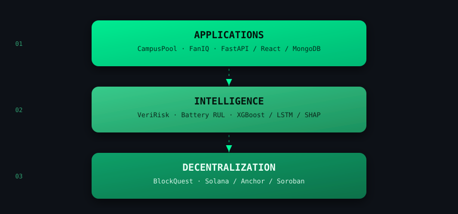

<div align="center">


<a href="https://www.linkedin.com/in/tapan-gupta-bbba68316/">
  
</a>
<a href="https://leetcode.com/u/ayIndran/">
  
</a>
<a href="mailto:tapangupta.2401@gmail.com">
  
</a>
<a href="https://github.com/guptatapan-24">
  
</a>


</div>

<br>

## `SYSTEM_STATUS`

```text
┌──────────────────────────────────────────────────────────────┐
│                     TAPAN // PROFILE                         │
├──────────────────────────────────────────────────────────────┤
│  🎓  RV College of Engineering          CGPA  : 9.87         │
│  📈  3rd Semester                       SGPA  : 10.0         │
│  🧠  LeetCode                                 : 360+ solved  │
│  ⛓️  BlockQuest Fellowship              Rank  : 7 / 100+     │
│  🏆  AI for Bharat Hackathon            Top   : 50 / 13,500+ │
│  🥇  CloneFest, RVCE                    Result: 1st Prize    │
└──────────────────────────────────────────────────────────────┘
```

<br>

## `ABOUT_ME`

```text
$ whoami
CSE student at RVCE, building backend systems, ML pipelines,
and Solana programs — and trying to understand each one deeply
enough to explain it, not just ship it.

$ focus --current
→ Backend engineering & systems design
→ Applied ML / explainable AI
→ Solana / Anchor development
→ Data Structures & Algorithms

$ philosophy
Build it. Break it. Understand why. Build it better.
```

<br>

## `./featured_projects`



<br>

<table>
<tr>
<td width="50%" valign="top">

### 🚌 CampusPool
**RVCE Ride-Sharing Platform**

`FastAPI` `React` `MongoDB` `Socket.IO`

Full-stack ride-sharing platform for RVCE students — ride lifecycle, real-time chat, SOS alerts, ID verification, admin moderation.

- 177+ students surveyed · 40+ interviews
- 84% positive adoption intent
- Concurrency-safe ride-request workflows

<!-- Record a 10–15s screen capture (e.g. ride creation → chat → SOS flow)
     and place it at assets/campuspool-demo.gif, then uncomment: -->
<!--  -->

[🌐 Live Demo](https://dtl-third-sem.vercel.app/) · [💻 Source](https://www.github.com/guptatapan-24/dtl-third-sem/tree/tapan/)

</td>
<td width="50%" valign="top">

### 🛡️ VeriRisk
**Verifiable AI Risk Oracle for DeFi**

`XGBoost` `FastAPI` `Next.js` `SHAP` `Soroban`

Explainable DeFi risk-prediction system with on-chain verification.

- 0.91 ROC-AUC
- Early-warning signals 24–600+ hrs pre-crash
- SHAP-based explainability, Soroban verification

<!--  -->

[💻 Source](https://www.github.com/guptatapan-24/el-second-year/)

</td>
</tr>
<tr>
<td width="50%" valign="top">

### 🔋 Battery RUL Prediction
**Physics-Informed Degradation Modeling**

`XGBoost` `LSTM` `FastAPI` `Streamlit`

Physics-informed RUL prediction pipeline for lithium-ion batteries.

- MAE: 66.7 → **5.06** cycles
- R²: −0.33 → **0.99**
- Presented at ICAMAS Conference, NIT Arunachal Pradesh

<!--  -->

[💻 Source](https://www.github.com/guptatapan-24/material-science-el-3rd-sem/)

</td>
<td width="50%" valign="top">

### ⚽ FanIQ
**AI-Powered Fan Behavior & Engagement Intelligence**

`LightGBM` `SHAP` `LLMs` `Python`

Operations-intelligence platform for FIFA-scale events — forecasting, segmentation, anomaly detection, grounded LLM analytics.

- 0.90 test R² (demand forecasting)
- 50K fans · 3.8M+ tickets · 66K+ social events
- 62/62 validation checks passing

<!--  -->

[💻 Source](https://www.github.com/guptatapan-24/fan-iq/)

</td>
</tr>
</table>

<br>

## `BLOCKCHAIN_LOG` — BlockQuest Fellowship

```text
Rank 7 / 100+ participants

Solana
  ├── Anchor Programs
  ├── PDAs
  ├── SOL Transfers
  ├── SPL Tokens
  ├── CPIs
  └── On-chain Events
```

**Assignment 01 — Piggy Bank** · PDA-based state, SOL deposits, owner-authorized withdrawals, unauthorized-access protection

**Assignment 02 — Token Presale dApp** · Anchor · SPL Tokens · backend services · on-chain events · frontend integration

<br>

## `TECH_STACK`

<div align="center">

</div>

**AI / ML** — XGBoost · LightGBM · LSTM · Random Forest · SHAP · LLM Integration
**Blockchain** — Solana · Anchor · SPL Tokens · PDAs · CPIs · Soroban

<br>

## `ACHIEVEMENTS`

| | |
|---|---|
| 🏆 **Top 50** | AI for Bharat Hackathon — 13,500+ teams nationwide |
| 🥈 **National Semifinalist** | Smart India Hackathon (SIH) 2025 |
| 🏅 **National Semifinalist** | Unisys Innovation Program |
| 🥇 **1st Prize** | CloneFest, RVCE |
| ⛓️ **Rank 7 / 100+** | BlockQuest Fellowship |

<br>

## `CURRENTLY_EXPLORING`

```text
→ Distributed systems & backend infrastructure
→ Production-grade AI systems
→ Solana / Anchor development
→ Advanced DSA

Last updated: September 2026
```

<br>

## `ACTIVITY`

<div align="center">


<br>

<!-- Snake animation: requires a one-time GitHub Action setup (see below). -->


</div>

<br>

<div align="center">

```text
$ git log --stats
✓ Learning   ✓ Building   ✓ Experimenting   ✓ Solving
```

Thanks for stopping by.

</div>


